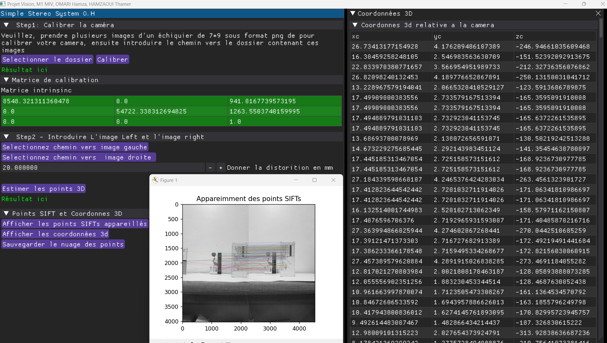

# Simple stéréo
Dans ce projet nous allons essayer d'estimer la profondeur des points SIFT appreillés à partir d'une paire d'image stereoscopique. En utilisant la technique de caméra calibration. à la fin le programme suavegarde le résultat en un ficher `ply`

### démonstration

# Usage 

### 1. calibrer la caméra   
En introduisant le chemin vers le dossier qui contient toutes les images prises par votre caméra, un nombre de 30 images de différentes position et bon pour bien estimer des valeurs avec un taux d'erreur négligeable.

une fois calibrer le programme vous affichera un tableau contenant ces valeurs. 

### 2. Introduction de la paire stéréoscopique
Il s'agit d'introduire le chemin vers `image_left` et `image_right`.
Les deux images doivent impérativement être prises soigneusement, d'une manière que la caméra soit translaté horizontalement, avec un paramétre de `disparity`, le mesurer et l'introduire.

### 3. Résultat 
Clicker sur le boutton: `esimer les points 3D` pour que le tableaux des corrdonnée par rapport au repére de la caméra soit affiché. un fichier `point_cloud.ply` sera créé et sauvegarder sur le meme chemin ou vous lancez le script. 

## Extra infos
Ce projet à été réalisé durant mon deuxième semestre à l'université en tant que etudiant en master informatique visuelle. Etant un projet final du module Computer Vision

## Licence
Ce projet ne contient pas de licence, vous pouvez à n'importe quelle fin. 